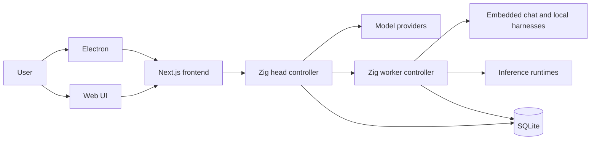

# Local Studio

Local Studio is a local-first workstation for running models and agent sessions
across a head controller and enrolled worker nodes. The desktop app combines a
Next.js interface, an Electron shell, and one Zig controller implementation.

## Repository

- [`controller/`](controller/README.md) contains the Zig controller, embedded
  agent harness integration, HTTP API, persistence, inference lifecycle, and
  provider gateways.
- [`contracts/`](contracts/) contains the TypeScript contracts consumed by the
  frontend and the JSON route/model contracts embedded into Zig builds.
- [`frontend/`](frontend/README.md) contains the Next.js 16 and React 19 UI plus
  the Electron desktop shell.
- [`shared/`](shared/) contains frontend-facing agent contracts and utilities.

The deleted Bun/Hono backend is not a runtime fallback. `controller/` is the
single backend used by local development, desktop packaging, CI, containers,
head nodes, and worker nodes.

## Architecture



The controller can run in head, worker, or standalone mode. The head owns the
public API and routes work to workers and providers. A worker owns machine-local
inference, harness processes, browser operations, terminals, and project tools.
Standalone mode combines those responsibilities in one process.

## Quick start

Prerequisites are Node.js 22.19+, npm 10+, Bun 1.3.14+, Python 3.10+, and Git.
Bun remains a build dependency for frontend tooling, the shared package, and
the small Cursor provider bridge; it no longer runs the controller.

```bash
npm run doctor
npm run setup
npm run dev:controller
```

In another terminal:

```bash
npm run dev
```

The default standalone controller listens on `127.0.0.1:8080`. Configure data,
models, network, and authentication through `LOCAL_STUDIO_*` environment
variables.

### Devenv

The locked devenv environment builds and starts a head, a local worker, the
frontend, and Electron:

```bash
devenv shell
devenv up
```

Individual processes can also be started with `devenv up head-node`,
`devenv up local-node`, `devenv up frontend`, or `devenv up electron`.

The isolated desktop stack uses `127.0.0.1:8082` for the head,
`127.0.0.1:8083` for the local worker, and `127.0.0.1:3100` for the frontend.
The process preflight rejects a second stack when any required port is busy.

## Build and validation

```bash
npm run build
npm run check
```

`npm run check` validates automation and contract structure, verifies the Zig
route registry, builds the controller, runs frontend static analysis, and
produces the frontend production build.

## Production

Build once, then run the controller and standalone frontend separately:

```bash
npm run build
npm run start:controller
npm run start
```

`npm run start` uses the repository standalone launcher so streaming behavior
matches the packaged desktop app. The production frontend binds to loopback by
default. Binding the controller to a non-loopback address requires an API key
unless unauthenticated access is explicitly enabled.

The controller image is built from [`controller/Dockerfile`](controller/Dockerfile).
The native installer is [`scripts/install-controller.sh`](scripts/install-controller.sh).

## Mobile companion

[KittyLitter](https://kittylitter.app) connects to Local Studio so agent
sessions, streamed content, reasoning, tool calls, and tool results are
available on mobile devices. Pairing data contains private controller
credentials and should only be shared with a trusted device.

## Contributing

Start from the latest `dev`, keep each branch and pull request focused, and do
not commit secrets or generated local state. Run `npm run check` before handoff.
See [AGENTS.md](AGENTS.md) for repository-specific engineering rules.

## License

See [LICENSE](LICENSE).
