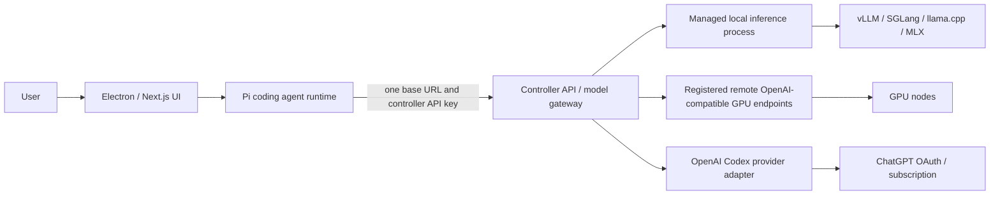

# Controller-side OpenAI Codex subscription provider plan

## Decision

Add OpenAI Codex subscription access to the **Controller API**, not directly to
the Pi agent runtime.

Pi keeps using one OpenAI-compatible Local Studio controller endpoint. The
controller selects an upstream from the requested model name:

- its managed local inference process (vLLM, SGLang, llama.cpp, or MLX);
- a registered remote OpenAI-compatible inference endpoint, such as a vLLM
  server on another GPU node; or
- the new `openai-codex` provider, authenticated with the user's ChatGPT/Codex
  subscription.

The native Codex agent harness is not part of this project. Pi remains the
agent harness and can be replaced independently later.

## Correct architecture



The OpenAI credential belongs to the controller-side `openai-codex` adapter.
It is never sent to Pi, the renderer, or a GPU node. Pi sees controller models
such as `local-model`, `lab-a/model-name`, and `openai-codex/gpt-5.3-codex` and
sends all of them to the same Controller API.

## What the repository currently does

The current source already supplies most of the gateway seam:

- `controller/src/modules/proxy/openai-routes.ts` accepts
  `POST /v1/chat/completions`, parses `provider/model`, rewrites the upstream
  model ID, and forwards the request.
- `controller/src/services/provider-routing.ts` resolves enabled providers to
  an upstream `base_url` and API key.
- `controller/src/modules/studio/provider-routes.ts` manages provider records
  and queries each provider's `/v1/models` endpoint.
- Local model requests are forwarded to the controller's managed inference
  port.
- The Zig agent harness makes Pi treat a controller as an OpenAI-compatible
  model provider.

There are two limitations that the design must not obscure:

1. A controller currently owns runtimes and process lifecycle on **its own
   host**, and the status model tracks one active inference process. vLLM,
   SGLang, llama.cpp, and MLX are alternative runtime families/targets rather
   than a built-in cluster of independently registered workers.
2. Local Studio currently handles multiple GPU hosts by saving multiple
   controller URLs in the desktop. It does not yet make remote GPU workers
   register themselves with one central controller.

For the requested one-endpoint experience, phase 1 registers already-running
remote OpenAI-compatible GPU endpoints as upstream providers of the primary
controller. Remote install/start/stop scheduling remains a later orchestration
phase.

## MVP scope

### Included

- One `openai-codex` controller provider type.
- One ChatGPT/Codex account per controller installation.
- Browser OAuth when the browser can reach the controller callback.
- Device-code login for a remote or headless controller.
- Controller-owned encrypted or permission-hardened credential persistence.
- Login status, login start/complete, refresh, logout, and revoke/error states.
- Controller-side model discovery for the Codex subscription.
- A canonical `/v1/responses` forwarding path with streaming and tool-call
  preservation.
- Controller model IDs qualified as `openai-codex/<model-id>`.
- Pi configured only with the Controller API.
- Existing API-key providers and local inference behavior preserved.
- Manual end-to-end validation for local, remote-GPU, and Codex routes.

### Deferred

- Replacing Pi with the Codex harness.
- Multi-user or public proxy hosting.
- Multiple ChatGPT accounts on one controller.
- Per-user quotas, billing, or tenant isolation.
- Controller-managed remote GPU installation, start/stop, and scheduling.
- Automatic failover or load balancing between GPU nodes.
- A general provider plug-in SDK.
- Full Chat Completions emulation if Pi can use the Responses API through the
  controller without it.

## Provider design

### 1. Replace URL-only routing with provider adapters

The current provider record assumes every remote provider is an
OpenAI-compatible base URL plus a static API key. Introduce a narrow adapter
interface without generalizing the whole controller:

```ts
interface ControllerProviderAdapter {
  id: string;
  kind: "openai-compatible" | "openai-codex";
  listModels(signal: AbortSignal): Promise<ProviderModel[]>;
  createResponse(request: Request, modelId: string): Promise<Response>;
  getStatus(): Promise<ProviderStatus>;
}
```

Keep the existing URL/API-key path as the `openai-compatible` adapter. Add an
`openai-codex` adapter whose transport and OAuth implementation are supplied by
the same official Pi provider package already used by Local Studio. Do not copy
Pi's private implementation or make the agent runtime a hidden proxy.

Likely controller changes:

- extend `controller/src/config/persisted-config.ts` with provider `kind` and
  non-secret connection metadata;
- refactor `controller/src/services/provider-routing.ts` to resolve an adapter,
  not only `{ baseUrl, apiKey }`;
- add `controller/src/services/providers/openai-compatible.ts`;
- add `controller/src/services/providers/openai-codex.ts`;
- add controller-owned auth/credential services;
- extend `controller/src/modules/studio/provider-routes.ts` for typed provider
  status and auth operations;
- add or extend `/v1/responses` in `controller/src/modules/proxy`;
- aggregate local and provider models in `/v1/models`.

Exact filenames can follow repository conventions during implementation; the
boundary is the important part.

### 2. Canonical request protocol

Use `POST /v1/responses` as the canonical Codex path because it preserves
reasoning, tool calls, streaming events, and Codex-specific request semantics.

Routing rules:

- unqualified/local recipe model -> current managed inference process;
- `<provider>/<model>` for an existing OpenAI-compatible provider -> that
  provider's base URL;
- `openai-codex/<model>` -> the OAuth-backed Codex adapter.

The controller strips only its routing prefix before calling the upstream. It
must preserve the stream body and status while normalizing errors into Local
Studio's response shape and usage records.

If the installed Pi version requires `/v1/chat/completions`, implement a small
compatibility adapter only after a spike proves which request/stream fields
need translation. Do not silently down-convert Responses requests and lose tool
or reasoning events.

### 3. Authentication flow

Expose controller auth routes under the existing Studio API, for example:

- `GET /studio/providers/openai-codex/status`
- `POST /studio/providers/openai-codex/login`
- `GET /studio/providers/openai-codex/login/:flowId`
- `POST /studio/providers/openai-codex/logout`

The login start response declares its mode:

- `browser`: returns an authorization URL and tracks PKCE state in the
  controller;
- `device_code`: returns the verification URL, user code, expiry, and poll
  interval for a remote/headless controller.

The controller performs token exchange and refresh. The renderer can open an
external browser and display progress, but never receives access or refresh
tokens.

For a controller running on the same Mac, the browser callback can terminate
locally. For a controller on a remote GPU/server host, use device-code login so
the desktop browser does not need to reach a loopback callback on the remote
machine.

### 4. Credential storage

Store OAuth credentials outside `studio-settings.json` in a controller-owned
secret store. Minimum acceptable behavior:

- directory mode `0700`, secret file mode `0600`;
- atomic writes;
- no token values in provider list/status responses;
- existing controller log redaction extended for OAuth fields;
- logout deletes the credential and in-memory session;
- refresh-token rotation is persisted immediately;
- corrupted or expired credentials become `reauth_required`, not a controller
  startup failure.

On macOS, Keychain-backed storage is preferred if it can be supported without
breaking Linux/headless deployment. Otherwise use a narrowly scoped local
secret file first and document the threat model.

### 5. Model catalog

`GET /v1/models` should return one controller-owned catalog containing:

- the active controller's local recipes/models;
- enabled OpenAI-compatible upstream models;
- enabled Codex subscription models.

Provider models must be qualified to make routing stable and collision-free.
The UI should display a provider badge but pass the exact qualified ID back to
Pi. Model availability and login status should be separate: a disconnected
Codex provider contributes no selectable models and shows a reconnect action.

## User interface changes

Use the existing provider/integrations surface, but make it controller-scoped:

1. Select the controller whose provider connection is being edited.
2. Show **OpenAI Codex subscription** as a provider card.
3. `Connect` calls that controller's login route.
4. Browser/device instructions are shown until the controller reports success.
5. On success, refresh the controller model catalog.
6. `Disconnect` removes the controller-side credential.

The copy should say which controller holds the account. This matters when the
desktop has several saved controllers: connecting Codex on controller A does
not automatically connect it on controller B.

For the intended single-gateway deployment, the desktop and Pi select only the
primary gateway controller. Remote GPU endpoints are configured inside that
gateway rather than exposed to Pi as additional controllers.

## Implementation phases

### Phase 0: protocol spike

Before production changes:

1. Pin the current Pi package version in the fork.
2. Exercise Pi's `openai-codex` login and transport in a controller-only
   script.
3. Record the auth functions, credential shape, refresh behavior, model list,
   request protocol, and streaming event format.
4. Confirm whether Pi can use the controller's `/v1/responses` endpoint
   directly.
5. Confirm browser callback behavior locally and device-code behavior on a
   remote/headless host.

Exit criterion: one controller-side script can authenticate, list models, and
complete a streamed tool-capable response without involving the agent runtime.

### Phase 1: adapter and secret store

1. Add typed provider configuration with backward-compatible migration of
   existing provider records.
2. Wrap existing base URL/API-key providers in the OpenAI-compatible adapter.
3. Add the Codex adapter.
4. Add controller credential persistence and redaction.
5. Add status/login/logout routes.

Exit criterion: controller routes report correct states across login, restart,
refresh, expiry, and logout without exposing secrets.

### Phase 2: Responses proxy and catalog

1. Add provider dispatch for `/v1/responses`.
2. Preserve streaming cancellation, tool events, reasoning, errors, and usage.
3. Aggregate qualified provider models into `/v1/models`.
4. Record provider=`openai-codex` in existing inference usage storage.
5. Preserve existing local `/v1/chat/completions` behavior.

Exit criterion: the same controller URL successfully serves both a local model
and `openai-codex/<model>`.

### Phase 3: Local Studio UI and Pi wiring

1. Add the controller-scoped Codex provider card and login progress UI.
2. Refresh model choices after connection changes.
3. Ensure Workbench sends Pi only the primary gateway URL and its API key.
4. Verify Pi never selects its direct `openai-codex` provider for these
   controller-qualified models.
5. Add clear reconnect and controller-unavailable error states.

Exit criterion: a user can connect the subscription, select local or Codex
models, and run both through the same controller from the desktop app.

### Phase 4: remote GPU upstreams

For each already-running GPU inference service:

1. bind the service only to a private interface or VPN;
2. require its inference API key;
3. add it to the primary controller as an OpenAI-compatible provider;
4. qualify its models with a stable node/provider ID;
5. verify health and model discovery from the controller host.

This produces one gateway for Pi without changing remote lifecycle management.
If the project later requires the primary controller to install, start, stop,
or schedule processes on multiple machines, design a separate authenticated
worker-registration protocol rather than overloading provider routing.

## Validation plan

The repository instructions say not to add automated tests. Use the existing
quality gate plus explicit manual acceptance evidence.

### Static/build validation

Run from the repository root:

```bash
npm run doctor
npm run setup
npm run check
```

Also inspect `git diff --check` and verify no credential values appear in build
artifacts, logs, snapshots, or frontend payloads.

### Local gateway acceptance

1. Start the controller and desktop app.
2. Launch a local inference recipe.
3. Connect the Codex subscription from the selected controller's provider
   card.
4. Confirm `/v1/models` contains the local model and qualified Codex models.
5. Send a streamed `/v1/responses` request to a Codex model through the
   controller URL.
6. Send a local inference request through the same URL and controller API key.
7. In Workbench, complete a tool-using Pi turn with each model.
8. Confirm usage records identify `local` versus `openai-codex`.

Example shape, with secrets supplied through the shell rather than committed:

```bash
curl --fail "$CONTROLLER_URL/v1/models" \
  -H "Authorization: Bearer $CONTROLLER_API_KEY"

curl --fail "$CONTROLLER_URL/v1/responses" \
  -H "Authorization: Bearer $CONTROLLER_API_KEY" \
  -H 'Content-Type: application/json' \
  -d '{"model":"openai-codex/MODEL_ID","input":"Reply with the word connected."}'
```

### Remote/headless controller acceptance

1. Start device-code login through the controller API.
2. Complete authorization on a separate browser device.
3. Verify the controller stores the credential and lists models.
4. Restart the controller and confirm the credential remains usable.
5. Force or wait for access-token expiry and confirm refresh succeeds.
6. Logout and verify the provider disappears while local inference remains
   usable.

### Remote GPU endpoint acceptance

1. Register one private vLLM/SGLang-compatible endpoint in the primary
   controller.
2. Confirm its models appear as `<node>/<model>`.
3. Complete a Pi turn using that model through the primary controller URL.
4. Stop the remote inference service and confirm only that provider becomes
   unavailable.
5. Block outbound OpenAI access and confirm local/remote GPU inference remains
   usable.
6. Stop the local managed process and confirm Codex remains usable.

### Security acceptance

- A renderer/network trace contains no ChatGPT access or refresh token.
- A GPU inference node receives no ChatGPT credential.
- Controller logs redact OAuth codes, tokens, and API keys.
- Replayed OAuth state and expired device codes are rejected.
- Controller API authentication protects every provider auth route.
- A non-loopback controller refuses unauthenticated startup unless the existing
  explicit opt-out is set.
- Logout invalidates local use immediately and attempts upstream revocation
  when supported.

## Deployment

### Single-machine development

- Controller: `127.0.0.1:8080`.
- Frontend/desktop: normal development process.
- Pi: receives only the controller URL and API key.
- Local MLX/llama.cpp runtime: launched by that controller.
- Codex credential: stored by that controller.

### Private gateway with GPU nodes

- Run one **primary controller/gateway** on a trusted always-on host.
- Expose it through private TLS/VPN networking and require
  `LOCAL_STUDIO_API_KEY`.
- Register private, API-key-protected OpenAI-compatible GPU inference URLs as
  provider upstreams.
- Connect the Codex subscription on the primary controller.
- Configure desktop and Pi with only the primary controller URL/API key.
- Do not expose the personal subscription gateway to the public internet.

The existing SSH controller installer is still useful when a GPU host needs
Local Studio's process lifecycle UI, but that produces another controller, not
a worker connected to the primary controller. Until worker orchestration is
implemented, choose one of these deployment modes per GPU host:

- run only the inference server and register its URL in the primary gateway; or
- run a full controller there and keep it as a separately saved controller.

### Release requirements

- Pin compatible Pi provider dependencies in the controller package/build.
- Bundle no credential or machine-specific configuration.
- Document browser and device-code login modes.
- Document controller data backup without copying active OAuth credentials by
  default.
- Build/sign/notarize the desktop through the repository's existing release
  workflow.
- Publish controller deployment configuration and upgrade/rollback steps.

## Risks and mitigations

| Risk | Mitigation |
|---|---|
| Subscription transport changes upstream | Pin the Pi package, isolate it behind one adapter, and include a live smoke check before upgrades. |
| OAuth callback cannot reach a remote controller | Use device-code login for remote/headless deployments. |
| Personal subscription is exposed to other users | Keep the gateway private and single-user; defer multi-tenant use. |
| Responses events are lost in Chat Completions conversion | Make `/v1/responses` canonical and add compatibility only after the protocol spike. |
| Remote GPU nodes are mistaken for managed controller workers | Label them as upstream endpoints; scope lifecycle orchestration separately. |
| Provider outage breaks local inference | Isolate adapter health and failure states so unrelated routes continue working. |
| Tokens leak through the UI or logs | Controller-only secret storage, payload minimization, permission hardening, and redaction checks. |

## Definition of done

The project is complete when:

1. Pi is configured with one Controller API endpoint.
2. The controller owns the OpenAI/Codex sign-in and credential lifecycle.
3. `/v1/models` exposes qualified local, remote-GPU, and Codex models.
4. `/v1/responses` routes `openai-codex/<model>` through subscription auth.
5. Existing local and API-key provider routes still work.
6. A desktop user can connect, reconnect, and disconnect the Codex account.
7. Local, Codex, and one remote GPU model pass manual end-to-end acceptance
   through the same controller URL.
8. Restart, refresh, logout, outage isolation, and secret-redaction checks pass.
9. `npm run check` passes in the supported Bun/Node environment.
10. Deployment and rollback instructions are documented for the chosen private
    gateway topology.
